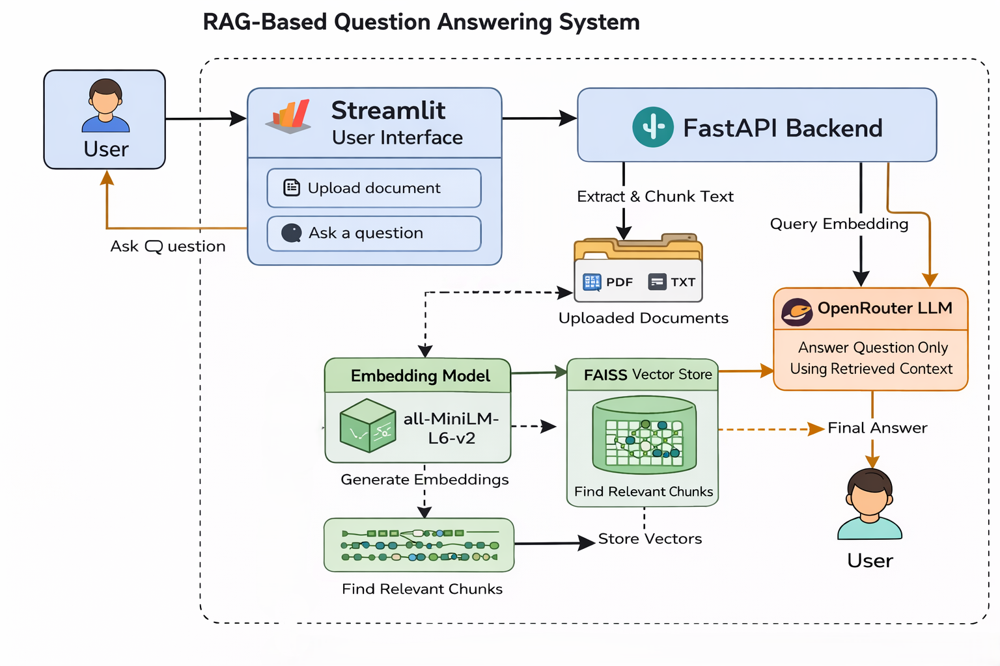

# 📄 RAG-Based Question Answering System

A **Retrieval-Augmented Generation (RAG)** system that allows users to upload documents and ask questions based strictly on the document content. The system combines **semantic search** with **LLM-based answer generation** using a hosted API (OpenRouter), ensuring accurate and grounded responses.

---

## 🚀 Features

* Upload **PDF** and **TXT** documents
* Automatic document chunking & embedding
* Vector similarity search using **FAISS**
* Answer generation using **OpenRouter LLM (Free API)**
* **FastAPI** backend with request validation
* **Rate limiting** to prevent abuse
* **Streamlit** user interface
* Clean, single-folder project structure

---

## 🏗️ System Architecture

**High-level flow:**

```
User
  ↓
Streamlit UI
  ↓
FastAPI Backend
  ↓
Document Upload & Parsing (PDF/TXT)
  ↓
Chunking (500 chars, 50 overlap)
  ↓
Embedding Model (all-MiniLM-L6-v2)
  ↓
FAISS Vector Store
  ↓
Query Embedding & Similarity Search
  ↓
Relevant Context Retrieval
  ↓
OpenRouter LLM
  ↓
Final Answer
```

**Architecture Diagram:**



---

## 📂 Project Structure

```
RAG-Based-Question-Answering-System/
├── main.py              # FastAPI backend
├── rag_utils.py         # Chunking, embeddings, FAISS logic
├── openrouter_llm.py    # OpenRouter API integration
├── streamlit_app.py     # Streamlit UI
├── requirements.txt     # Dependencies
├── .env                 # API keys
├── data/                # Uploaded documents
└── vectorstore/         # FAISS index files
```


---

## ⚙️ Setup Instructions

### 1️⃣ Clone the Repository

```bash
git clone <https://github.com/SohamDey2005/RAG-Based-Question-Answering-System.git>
cd RAG-Based-Question-Answering-System
```

### 2️⃣ Create Virtual Environment

```bash
python -m venv env
env\Scripts\activate   # Windows
# source env/bin/activate  # Linux/Mac
```

### 3️⃣ Install Dependencies

```bash
pip install --upgrade pip
pip install -r requirements.txt
```

### 4️⃣ Configure Environment Variables

Create a `.env` file in the root directory:

```env
OPENROUTER_API_KEY=your_openrouter_api_key
```

You can obtain a free API key from [https://openrouter.ai](https://openrouter.ai)

---

## ▶️ Running the Application

### Start FastAPI Backend

```bash
uvicorn main:app --reload
```

The API will be available at:

```
http://127.0.0.1:8000
```

### Start Streamlit UI (New Terminal)

```bash
streamlit run streamlit_app.py
```

Open in browser:

```
http://localhost:8501
```

---

## 🔐 Rate Limiting

Implemented using **SlowAPI**:

| Endpoint  | Limit              |
| --------- | ------------------ |
| `/upload` | 5 requests/minute  |
| `/ask`    | 10 requests/minute |

This prevents API abuse and ensures system stability.

---

## 🧪 Example Usage

1. Upload a PDF or TXT document
2. Wait for ingestion and indexing
3. Ask questions related to the document
4. Receive context-aware answers generated by the LLM

---

## 📊 Design Decisions

* **Chunk Size:** 500 characters with 50-character overlap
* **Embedding Model:** sentence-transformers/all-MiniLM-L6-v2
* **Vector Store:** FAISS (local, lightweight, fast)
* **LLM Provider:** OpenRouter (free-tier friendly)

Detailed explanations are provided in `EXPLANATION.md`.

---

## ⚠️ Known Limitations

* Pure semantic retrieval may miss structurally important sections (e.g., conclusions)
* No document-level metadata filtering
* Free API models may have rate or quality limits

---

## 🚀 Future Improvements

* Hybrid retrieval (keyword + vector search)
* Source citations for answers
* Streaming LLM responses
* Authentication & user sessions
* Dockerized deployment

---

## 📜 License

This project is for educational and assessment purposes.

---

## 🙌 Acknowledgements

* Sentence Transformers
* FAISS
* FastAPI
* Streamlit
* OpenRouter
